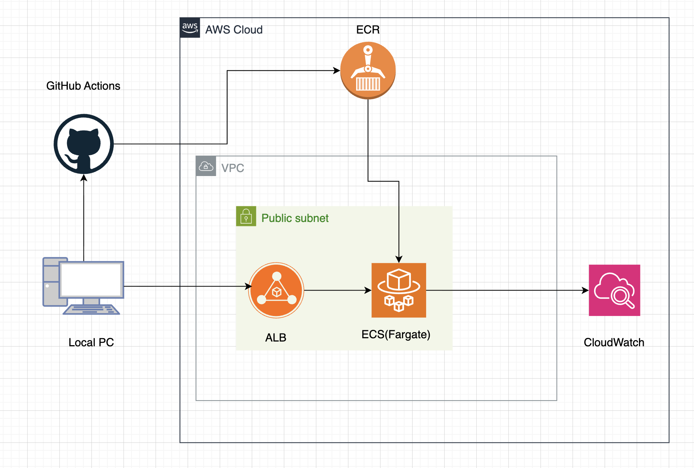
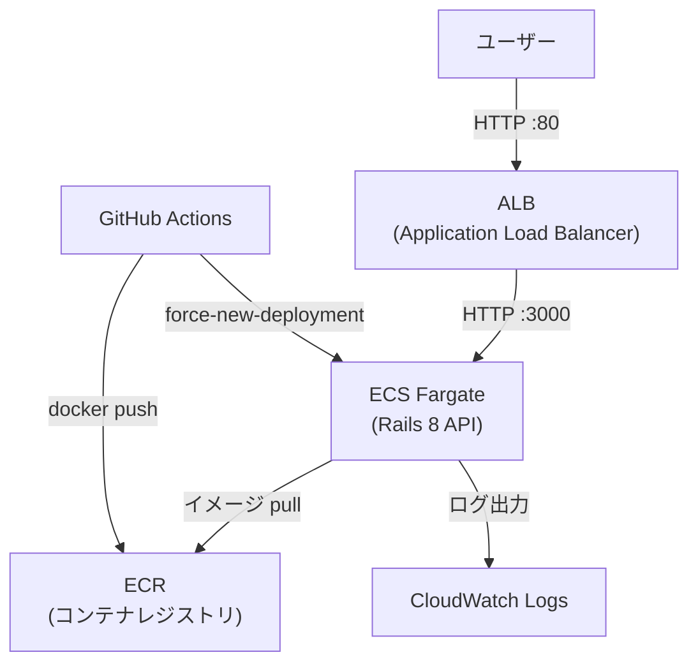

# fargate-rails-api-infra

Rails 8 API を AWS ECS(Fargate) 上にデプロイするポートフォリオプロジェクトです。
Terraform によるインフラのコード化と、GitHub Actions による CI/CD パイプラインの構築を目的としています。

---

## 構成図





---

## 使用技術

| カテゴリ | 技術 |
|---------|------|
| アプリケーション | Ruby 3.3 / Rails 8 (API モード) |
| インフラ | AWS ECS Fargate / ALB / ECR / VPC / IAM / CloudWatch |
| IaC | Terraform |
| CI/CD | GitHub Actions (OIDC 認証) |
| コンテナ | Docker (マルチステージビルド) |

---

## アーキテクチャのポイント

**シンプルかつモダンな構成**

- パブリックサブネットのみのシンプルなネットワーク構成（NAT Gateway なしでコスト最適化）
- ECS Fargate によるサーバーレスなコンテナ実行環境

**セキュリティ**

- ALB と ECS タスクのセキュリティグループを分離（ECS タスクへの直接アクセスを遮断）
- GitHub Actions の AWS 認証に OIDC を採用（Access Key を使用しない）

**CI/CD**

- `main` ブランチへのマージをトリガーに自動デプロイ
- イメージタグに `$GITHUB_SHA` を使用しトレーサビリティを確保
- `--platform linux/amd64` を指定し Apple Silicon 環境でも正しくビルド

---

## ディレクトリ構成

```
fargate-rails-api-infra/
├── app/                   # Rails 8 API
│   ├── app/
│   │   └── controllers/
│   │       ├── root_controller.rb
│   │       └── health_controller.rb
│   ├── config/
│   │   ├── routes.rb
│   │   └── puma.rb
│   ├── Dockerfile
│   └── Gemfile
├── infra/                 # Terraform
│   ├── main.tf            # 全リソース定義
│   ├── variables.tf       # 変数定義
│   ├── outputs.tf         # 出力値
│   └── terraform.tfvars   # 変数の値
└── .github/
    └── workflows/
        └── deploy.yml     # CI/CD パイプライン
```

---

## API エンドポイント

| Method | Path | レスポンス |
|--------|------|-----------|
| GET | `/` | `{"message":"Hello from Fargate!"}` |
| GET | `/health` | `{"status":"ok"}` |

---

## ローカル動作確認

```bash
# app/ ディレクトリで実行
cd app

# イメージをビルド
docker build -t rails-api .

# コンテナを起動
docker run --rm \
  -e RAILS_ENV=production \
  -e SECRET_KEY_BASE=dummy \
  -e PORT=3000 \
  -p 3000:3000 \
  rails-api

# 動作確認
curl http://localhost:3000/
curl http://localhost:3000/health
```

---

## AWS デプロイ手順

### 事前準備

- AWS CLI のセットアップ
- Terraform のインストール
- tfstate 管理用 S3 バケットの作成

### 1. ECR にイメージを push

```bash
# ビルド（Apple Silicon の場合）
docker build --platform linux/amd64 -t rails-api ./app

# ECR にログイン
aws ecr get-login-password --region ap-northeast-1 | \
  docker login --username AWS --password-stdin \
  <AWS_ACCOUNT_ID>.dkr.ecr.ap-northeast-1.amazonaws.com

# タグ付け & push
docker tag rails-api:latest \
  <AWS_ACCOUNT_ID>.dkr.ecr.ap-northeast-1.amazonaws.com/rails-api:latest
docker push \
  <AWS_ACCOUNT_ID>.dkr.ecr.ap-northeast-1.amazonaws.com/rails-api:latest
```

### 2. Terraform でインフラを構築

```bash
cd infra

terraform init
terraform plan
terraform apply
```

### 3. 動作確認

```bash
terraform output alb_dns_name

curl http://<alb_dns_name>/
# => {"message":"Hello from Fargate!"}
```

---

## CI/CD パイプライン

`main` ブランチへの push をトリガーに以下が自動実行されます。

```
push to main
  ├─ docker build --platform linux/amd64
  ├─ ECR へ push（タグ: $GITHUB_SHA / latest）
  └─ ECS サービスを force-new-deployment で更新
```

GitHub Secrets に以下を設定してください。

| Secret 名 | 説明 |
|-----------|------|
| `AWS_ROLE_ARN` | OIDC 認証用 IAM ロールの ARN |
| `AWS_REGION` | `ap-northeast-1` |
| `ECR_REPOSITORY` | `rails-api` |
